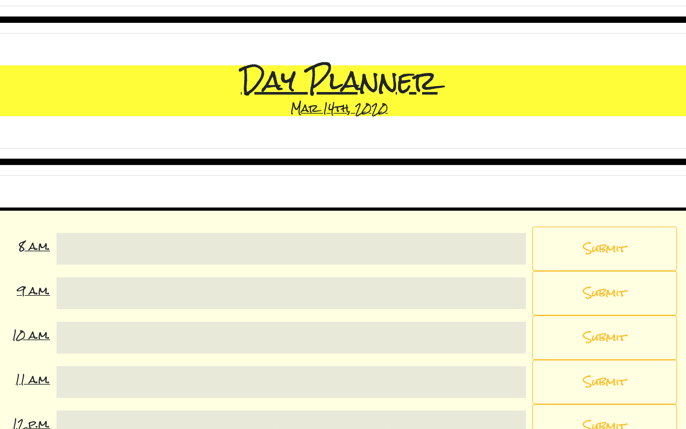
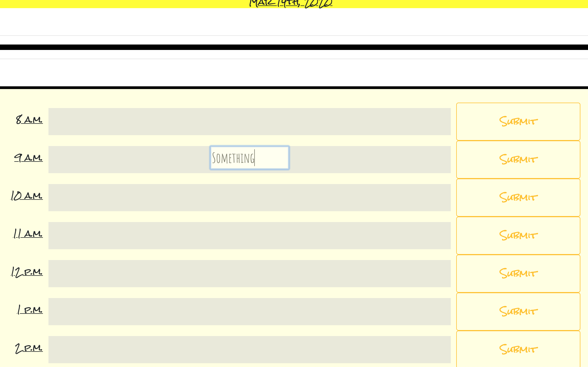
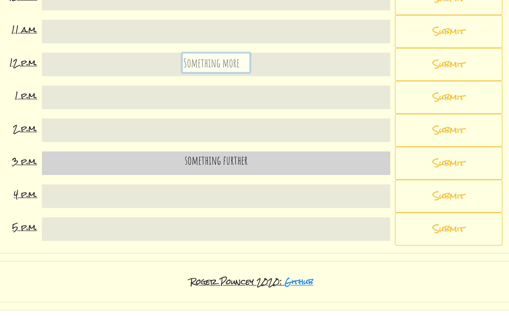

**ReadMe**

**A simple calendar application that allows the user to save events for each hour of the day. This app runs in the browser and features dynamically updated HTML and CSS powered by jQuery**

**This calendar features 10 divs which represent one-hour slots of any given day.  The top of the calendar features a header that uses MomentJS to dynamically update the day.** 

**Upon clicking into any of the divs, an input field appears which allows the user to enter text.  Clicking the submit button next to the div allows the user to save the text to that div.  Div opacity defaults to .5, but upon submit texting the opacity animates to 1.  An opacity of 1 is maintained for any div that contains text.  Events are stored in localStorage so that users can maintain their text after refreshing or closing the page.**

**Hour slots are dynamically colored depending on the time of day: grey divs indicate time periods that have already passed, a green div indicates the slot of the current hour, and blue divs represent time periods that have not yet arrived.**   